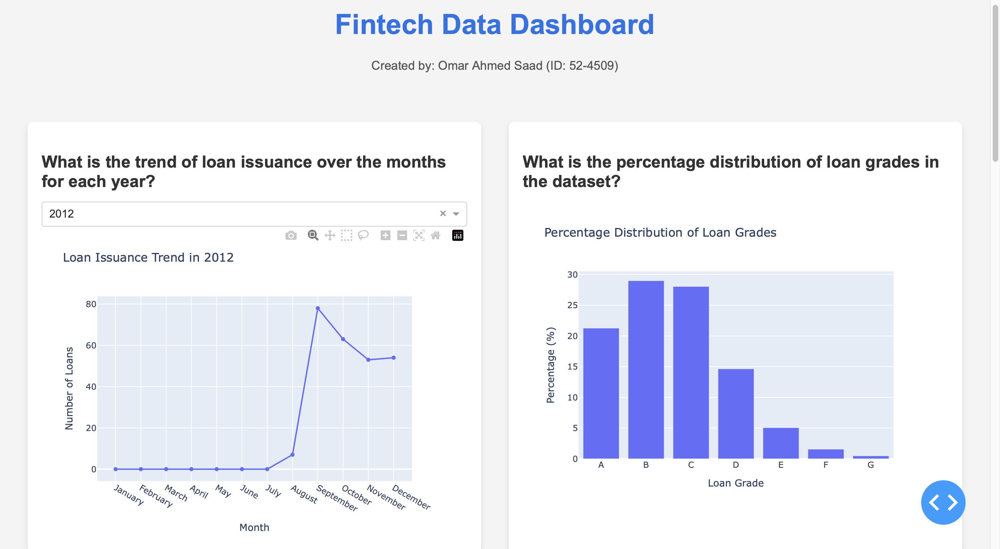
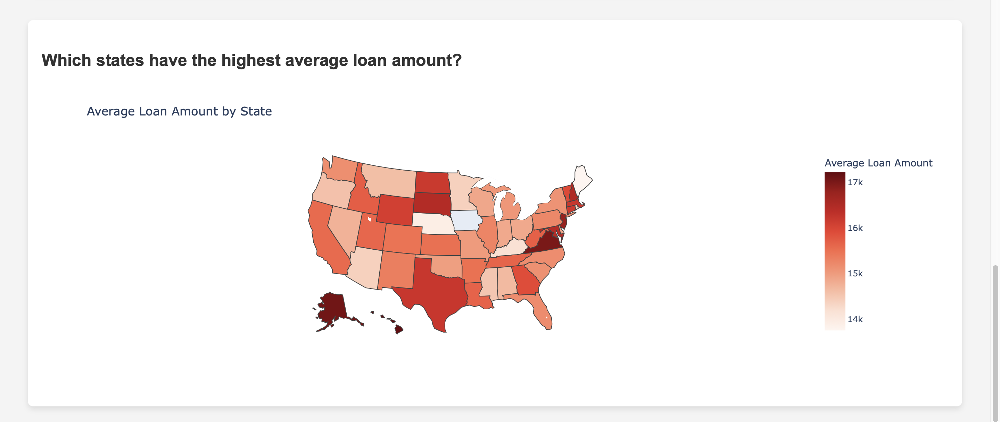

## DATA ENGINEERING 101 - Project

### Project Description and Objectives
In this project, the aim was to learning how to create a data pipeline using Python and SQL. The project was divided into four parts: 
1. Data Exploration ,Cleaning and Transformation
2. Loading Data into a postgres database, using kafka and zookeeper to stream data
3. Using spark to process the data and load it into a postgres database
4. Creating a dashboard to visualize the data

### Data Exploration ,Cleaning and Transformation
The data used in this project was financial data from an online retail store. The data was in a csv format and contained information on the loans given out by the company. The data was cleaned and transformed to remove any null values , duplicates and any other inconsistencies in the data. The data was then loaded into a postgres database.

### Loading Data into a postgres database, using kafka and zookeeper to stream data
The data was loaded into a postgres database using a python script. Kafka was added to the pipeline to stream new data into the database after cleaning. Zookeeper was used to manage the kafka cluster.

### Using spark to process the data and load it into a postgres database
Spark was used as a kind of exercise to redo part one of the project, Although it was not necessary to use spark in this project as scale was not an issue but it was a good learning experience. The data was processed using spark and loaded into a postgres database.

### Creating a dashboard to visualize the data
A dashboard was created using Dash to visualize the data. The dashboard contained information on the loans given out by the company. The aim was to answer and give insights on the following 5 questions:
1. What is the trend of loan issuance over the months for each year?
2. What is the percentage distribution of loan grades in the dataset?
3. What is the distribution of loan amounts across different grades?
4. Which states have the highest average loan amount?
5. How does the loan amount relate to annual income across states?

### Dashboard Screenshots

